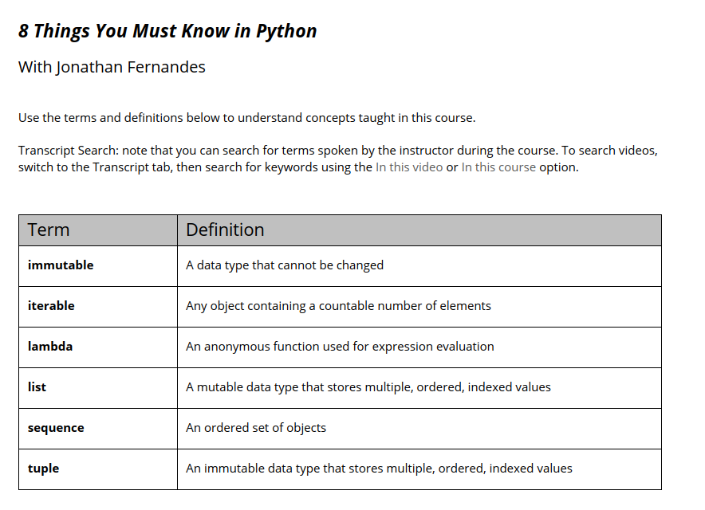
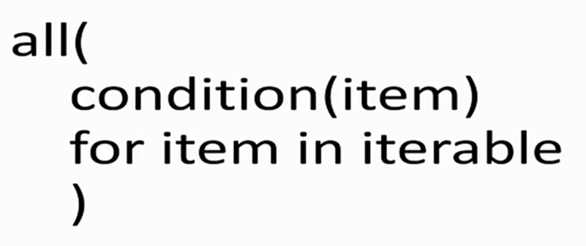
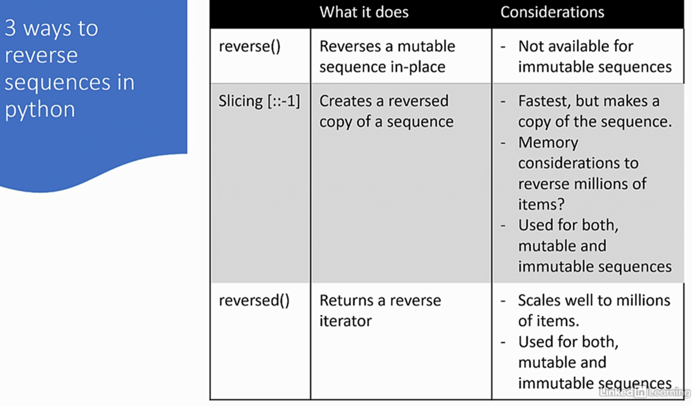
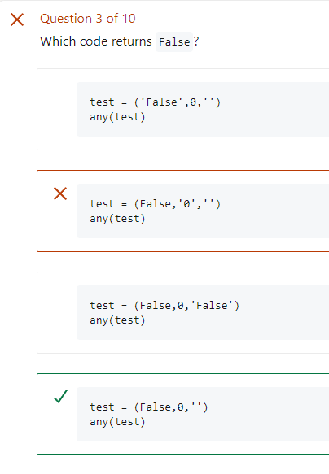
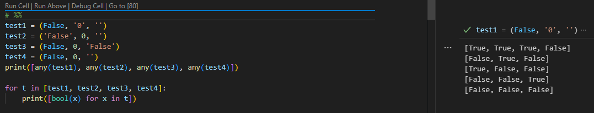

# VENV setup

```python
python3 -m pip install --user pipenv
python3 -m venv env
source env/Scripts/activate

pip install pytest
pip install ipykernel
```





https://djangostars.com/blog/list-comprehensions-and-generator-expressions/


## List Comprehension & Enumerable
**List Comprehension**: [i for i in range(10)]
**Enumerable**: (i for i in range(10))

***list() function over enumerable:***
``list((i for i in range(10)))``

```python
gen = (x for x in range(10))
# 1. Using list comprehension
print('list comprehension')
print([x for x in gen])
# 2. Using the list() function
print('list function')
gen = (x for x in range(10))
print(list(gen))
# 3. Using the * operator
print ('* unpack operator')
gen = (x for x in range(10))
print([*gen])

gen = (x for x in range(10))
print(*gen)
```

## Slicing
```python
mylist[:1] : up to 1, index + 1 is the end point.
mylist[::-1] # reverse
sentence[:-3] # remove the last chars
```

Explanation of births[:index + 1]
births[:index + 1] is a slice of the births list.
index + 1 is the endpoint of this slice, which means that Python will take elements from the start of births up to, but not including, index + 1.
Effectively, births[:index + 1] creates a sublist containing elements from the start of births up to and including the element at position index.

## String
```python
string.ascii_uppercase
string.ascii_lowercase
string.punctuation

def remove_punctuation(word):
    """Helper function to remove punctuation from word"""
    table = str.maketrans({char:None for char in word if char in string.punctuation})
    return word.translate(table)
```

## Reverse
- mylist.reverse() # in memory
- reversed(list)
- mylist[::-1] # slicing notation



### Find execution path
```python
import string
import os
DICTIONARY = 'dictionary.txt'
base_dir = os.path.dirname(os.path.abspath(__file__))
file_path = os.path.join(base_dir, DICTIONARY)
```

## min max solution
```python
import string
import os
DICTIONARY = 'dictionary.txt'
base_dir = os.path.dirname(os.path.abspath(__file__))
file_path = os.path.join(base_dir, DICTIONARY)

letter_scores = {
                    'a': 1, 'b': 3, 'c': 3, 'd': 2, 'e': 1, 'f': 4, 'g': 2, 'h': 4, 
                    'i': 1, 'j': 8, 'k': 5, 'l': 1, 'm': 3, 'n': 1, 'o': 1, 'p': 3, 
                    'q': 10, 'r': 1, 's': 1, 't': 1, 'u': 1, 'v': 4, 'w': 4, 'x': 8, 
                    'y': 4, 'z': 10
                }

def get_scrabble_dictionary():
    
    """Helper function to return the words in DICTIONARY as a list"""
    with open(file_path, 'rt', encoding='utf-8') as file:
        content = file.read().splitlines()
    return content

def score_word(word) -> int:
    """Return the score for a word using letter_scores.
    If the word isn't in DICTIONARY, it gets a score of 0.""" 
    # use set for faster lookup
    dictionary = set(get_scrabble_dictionary())
    if(word.upper() not in dictionary):
        return 0
    # split the string into an array of characters
    #chracters = list(word.lower())
    #return sum([ letter_scores[c] if c in letter_scores else 0 for c in chracters])

    return sum(letter_scores.get(c.lower(), 0) for c in word)

def remove_punctuation(word):
    """Helper function to remove punctuation from word"""
    table = str.maketrans({char:None for char in word if char in string.punctuation})
    return word.translate(table)

def get_word_largest_score(sentence) -> str:
    """Given a sentence, return the word in the sentence with the largest score."""
    # split sentence to an array of words
    removed = remove_punctuation(sentence)
    words = removed.split()
    scored_words = [(w,score_word(w)) for w in words]
    # get the word with the largest score
    #return max(scored_words , key=lambda w: w[1])[0]

    return max([word for word in removed.split()], key=score_word)
```

### Sorted with Tuple
```python
#%%
class Country:
    def __init__(self, name, population):
        self.name = name
        self.population = population    
    def __repr__(self):
        return f'Country({self.name}, {self.population})'

country_list = [
                Country('Taiwan', 24_000_000),
                Country('Portugal', 10_000_000), 
                Country('Netherlands', 17_500_000), 
                Country('Nigeria', 198_000_000), 
                Country('Jordan', 10_000_000), 
                Country('Nepal', 30_000_000), 
                Country('Niger', 24_000_000), 
                Country('Japan', 128_000_000)
]

iso = [('Taiwan', 'iso24000000'), ('Portugal', 'iso10000000'), ('Netherlands', 'iso17500000'), ('Nigeria', 'iso198000000'), ('Jordan', 'iso10000000'), ('Nepal', 'iso30000000'), ('Niger', 'iso24000000'), ('Japan', 'iso128000000')]
# %%
print('sorted by population reverse')
sorted(country_list, key=lambda x: x.population, reverse=True)

# %%
print('sorted by population minus')
sorted(country_list, key=lambda x: -x.population)
# %%
sorted(country_list, key=lambda x: (-x.population, x.name))
# %%
sorted(iso, key=lambda x: int(x[1][3:]))
# %%
[(c,int(i[3:])) for c,i in iso]
```

### Quiz




**'False' and '0' are True**