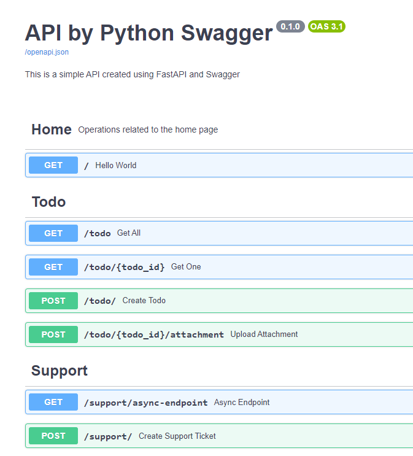

# How to get started

## virtual env
```
$ mkdir projectA
$ cd projectA
$ pyton3 -m venv env
$ . env/Scripts/activate

$ pip list
Package Version
------- -------
pip     24.2
(env)

pip install "fastapi[all]"
pip install sqlalchemy

or 

pip freeze > requirements.txt 
pip install -r requirements.txt
...

$ deactivate
```

```script
uvicorn app.main:app --reload
```

## Swagger
http://127.0.0.1:8000/docs

