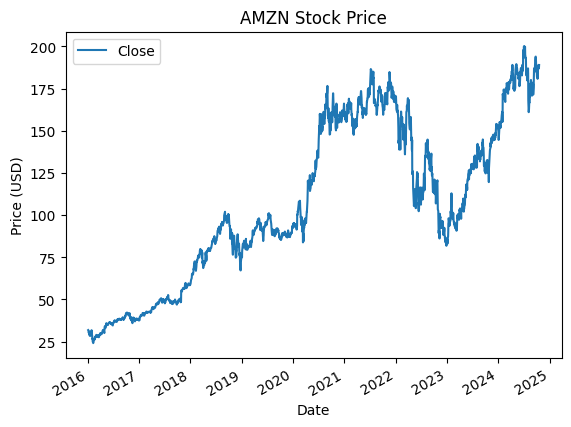
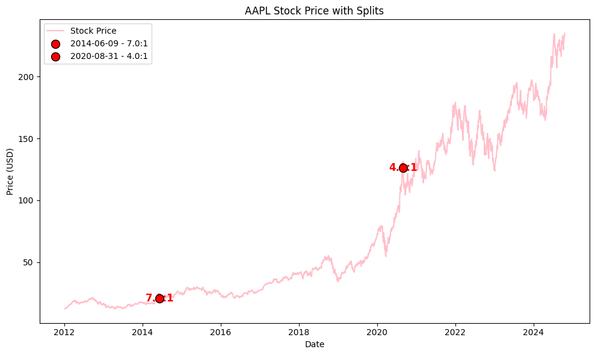
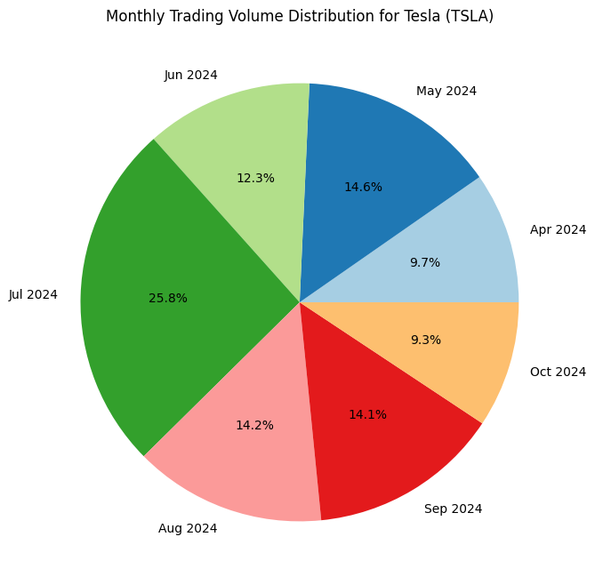
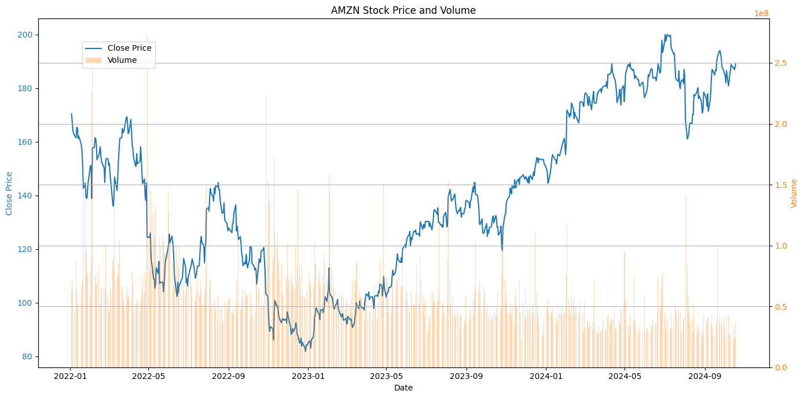

## VENV setup

https://docs.python.org/3/library/venv.html

```shell
python3 -m pip install --user pipenv
python3 -m venv env
source env/Scripts/activate
```

-m: This flag tells Python to run a module as a script. Here, it's used to run the venv module.

venv: This is the module that comes with Python's standard library, used to create lightweight, isolated Python environments.

env: This is the name of the directory where the virtual environment will be created. You can name this whatever you want, but it's common to use names like env, venv, or .venv to indicate that this directory is a virtual environment.


```shell
$ pip3 list
Package Version
------- -------
pip     24.2
(env)

$ pip3 install ipykernel -U --force-reinstall
$ pip3 install matplotlib

or 
$ python.exe -m pip install ipykernel -U --force-reinstall

$ pip3 install yfinance
$ pip3 install tabulate

$ pip3 freeze > requirements.txt 
```

## Yahoo Finance
- https://pypi.org/project/yfinance/
- https://github.com/ranaroussi/yfinance
- https://aroussi.com/post/python-yahoo-finance
- https://www.geeksforgeeks.org/get-financial-data-from-yahoo-finance-with-python/
- https://www.geeksforgeeks.org/getting-stock-symbols-with-yfinance-in-python/?ref=oin_asr2


```shell
$pip install yfinance --upgrade --no-cache-dir
```

### Historical Prices


### Stock SPlit


### Trading Volume


### Stock Price and Volume
