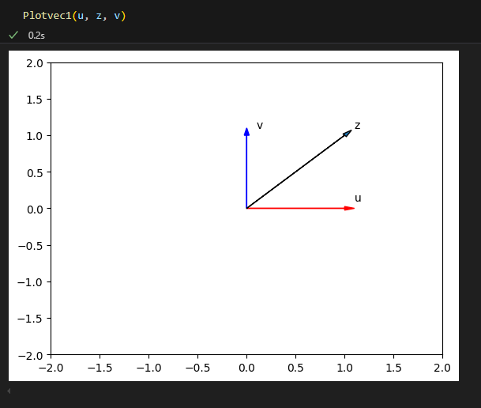
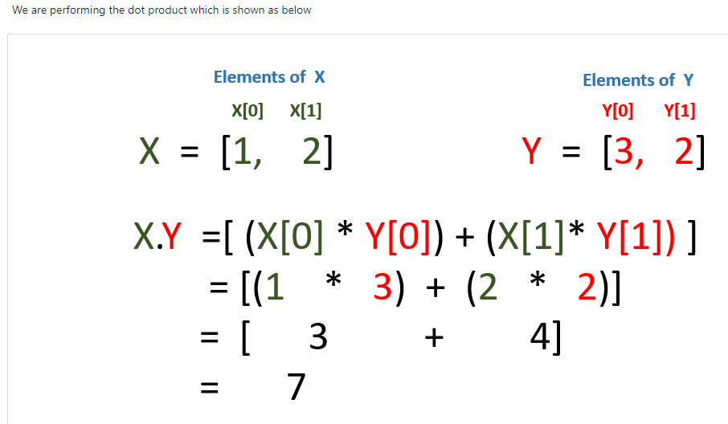
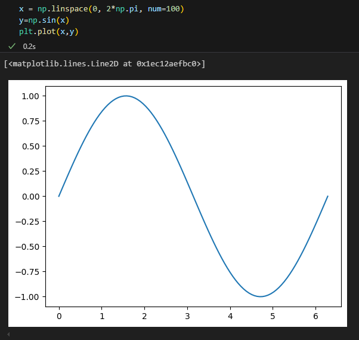
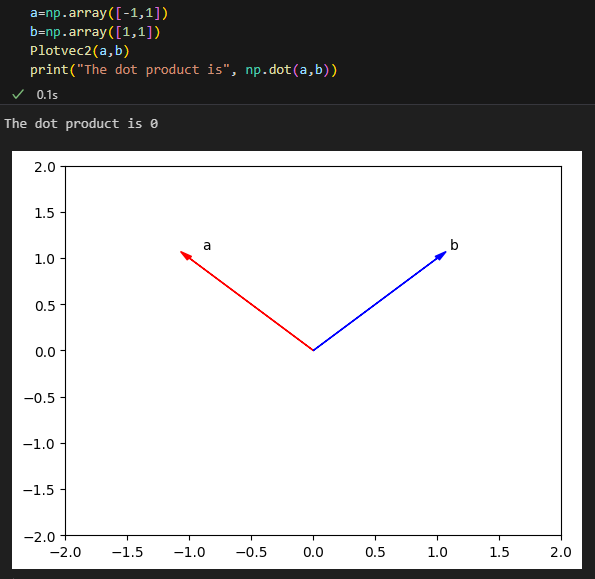
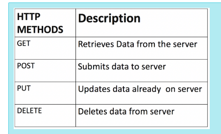
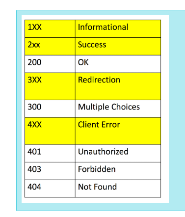
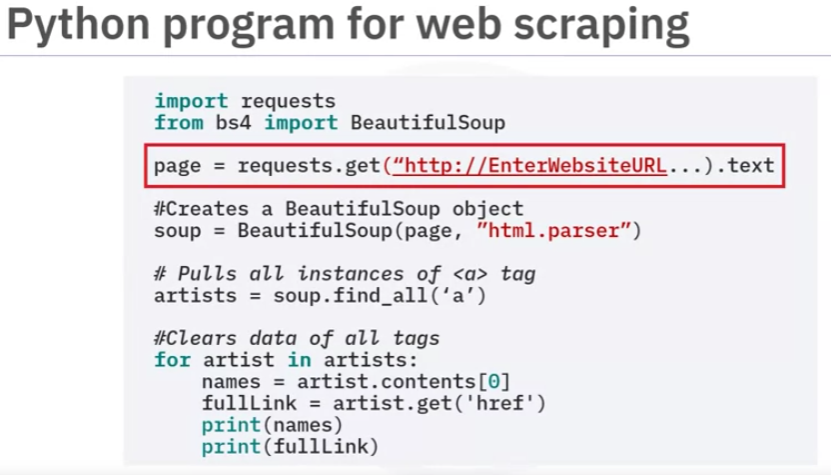
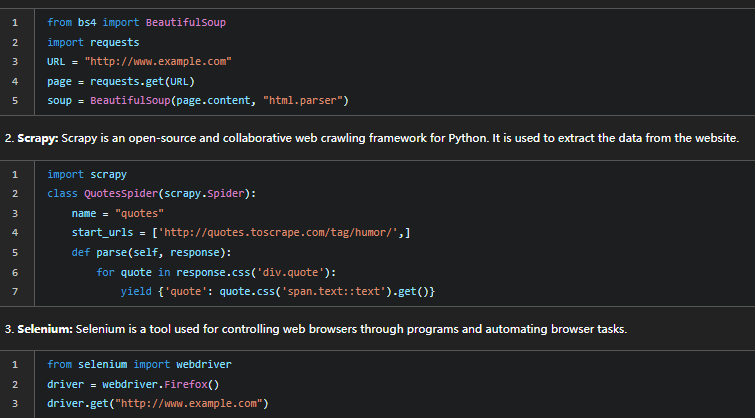
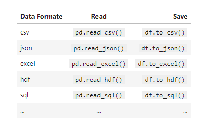
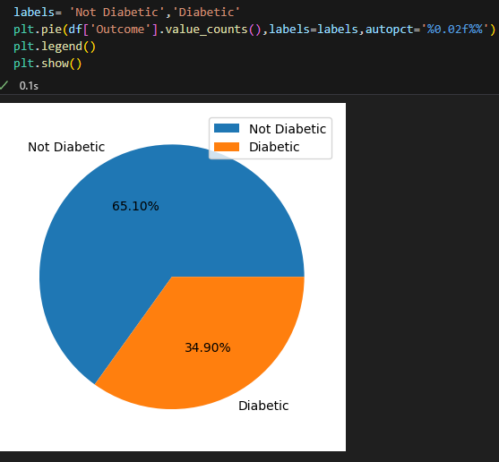

# virtual env

```python
$ mkdir projectA
$ cd projectA
$ python3 -m venv env
$ . env/Scripts/activate

$ pip list
Package Version
------- -------
pip     24.3.1
(env)

pip install pytest
pip install ipykernel
pip install panda
pip intall numpy
pip install matplotlib
#pip install beautifulsoup4
pip install bs4
pip install lxml
pip install randomuser
pip install requests html5lib 

or 

pip freeze > requirements.txt 
pip install -r requirements.txt

# to upgrade PIP
python.exe -m pip install --upgrade pip

# to run interactively

#%%

then, shift + enter
...
```

https://code.visualstudio.com/docs/datascience/jupyter-notebooks
[Open Public APis](https://mixedanalytics.com/blog/list-actually-free-open-no-auth-needed-apis/)
[100  most Highly-Ranked Films](https://web.archive.org/web/20230902185655/https://en.everybodywiki.com/100_Most_Highly-Ranked_Films)



dot product


```python
x = np.linspace(0, 2*np.pi, num=100)
y=np.sin(x)
plt.plot(x,y)
```





# webscraping with requests



BeautifulSoup
Scrapy
Selenimum



https://medium.com/swlh/web-scraping-using-selenium-and-beautifulsoup-adfc8810240a



